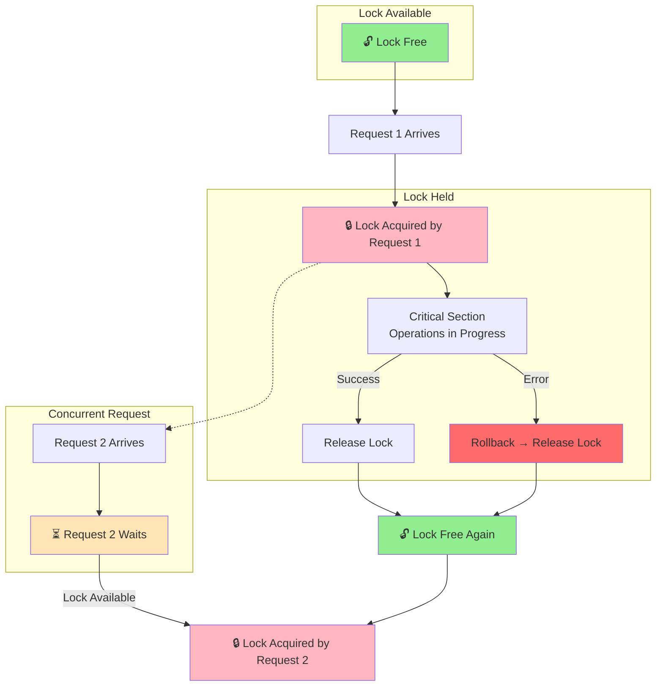
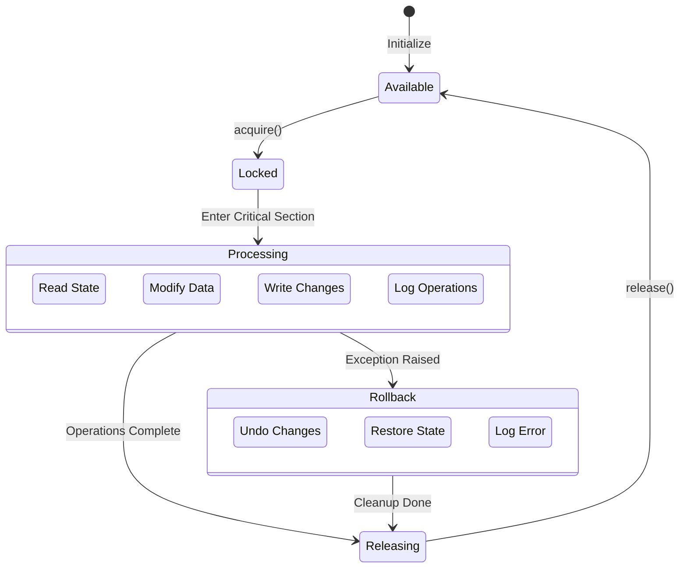
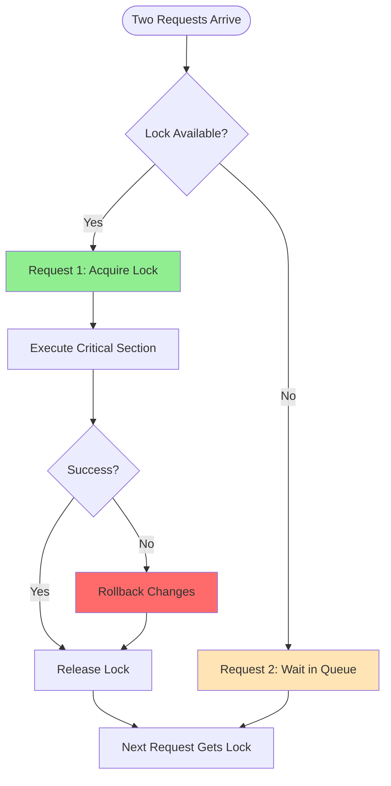
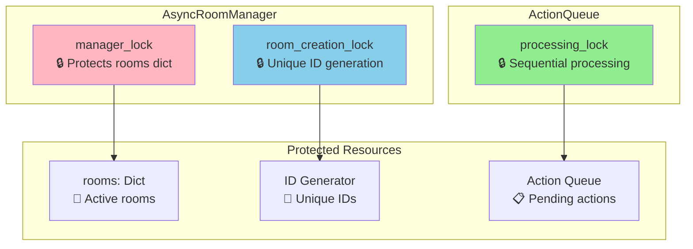

# Lock Acquisition Flow - Alternative Visualizations

## Option 1: Visual Lock States (Recommended)

Shows the lock lifecycle with clear visual states.

## Option 2: Timeline View

Shows how locks prevent race conditions over time.

```mermaid
gantt
    title Concurrent Request Timeline
    dateFormat X
    axisFormat %s

    section Request 1
    Acquire Lock          :done, r1lock, 0, 1
    Critical Operations   :active, r1ops, 1, 4
    Release Lock         :done, r1rel, 5, 1

    section Lock Status
    Available            :done, avail1, 0, 0
    Locked by R1         :crit, locked1, 0, 5
    Available Again      :done, avail2, 5, 5

    section Request 2
    Wait for Lock        :crit, r2wait, 1, 4
    Acquire Lock         :done, r2lock, 5, 1
    Operations           :active, r2ops, 6, 3
```

## Option 3: State Machine View

Shows lock states and transitions.

## Option 4: Simplified Flow

Focus on the core concept of mutual exclusion.

## Option 5: Lock Types Overview

Shows all lock types in the system at a glance.

## Recommendation

I recommend **Option 1 (Visual Lock States)** as the primary diagram because:
- Clear visual representation of lock states (🔓 free, 🔒 locked, ⏳ waiting)
- Shows both success and error paths
- Easy to understand the mutual exclusion concept
- Demonstrates how concurrent requests are handled

You could supplement with **Option 5** to show all the different lock types in the system.
