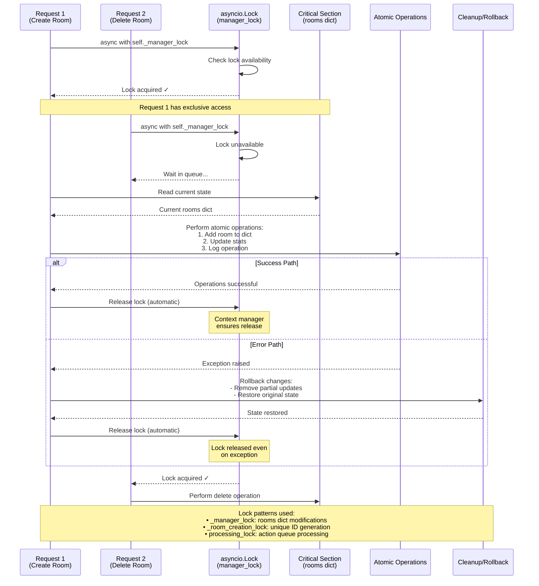

# Lock Acquisition Flow - Atomic Operations

This diagram demonstrates how atomic operations prevent race conditions through proper lock management.



## Key Lock Types in the System

### 1. Manager Lock (`self._manager_lock`)
- **Purpose**: Protects the rooms dictionary from concurrent modifications
- **Usage**: Creating, deleting, or modifying room entries
- **Pattern**: `async with self._manager_lock:`

### 2. Room Creation Lock (`self._room_creation_lock`)
- **Purpose**: Ensures unique room ID generation
- **Usage**: During room creation to prevent ID collisions
- **Pattern**: Sequential room ID generation

### 3. Processing Lock (`self.processing_lock`)
- **Purpose**: Ensures action queue processes one batch at a time
- **Usage**: In the action queue's `process_actions()` method
- **Pattern**: Prevents concurrent action processing

## Code Examples

```python
# AsyncRoomManager - Atomic room operations
async def create_room(self, host_name: str) -> str:
    async with self._room_creation_lock:
        # Generate unique room ID
        room_id = await self._generate_unique_room_id()

        # Create async room
        room = AsyncRoom(room_id, host_name)

        # Add to rooms dict with lock
        async with self._manager_lock:
            self.rooms[room_id] = room
            self._stats["rooms_created"] += 1
            self._stats["total_operations"] += 1

# ActionQueue - Atomic action processing
async def process_actions(self) -> List[GameAction]:
    async with self.processing_lock:
        self.processing = True
        processed_actions = []
        try:
            while not self.queue.empty():
                action = await self.queue.get()
                processed_actions.append(action)
                self.queue.task_done()
        finally:
            self.processing = False
        return processed_actions
```

## Benefits

1. **Race Condition Prevention**: Only one operation can modify critical sections at a time
2. **Automatic Cleanup**: Context managers ensure locks are always released
3. **Exception Safety**: Locks released even if operations fail
4. **Deadlock Prevention**: Consistent lock ordering and timeouts
5. **Transaction-like Behavior**: All-or-nothing operations with rollback capability
