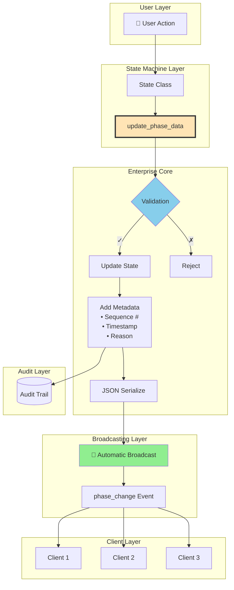
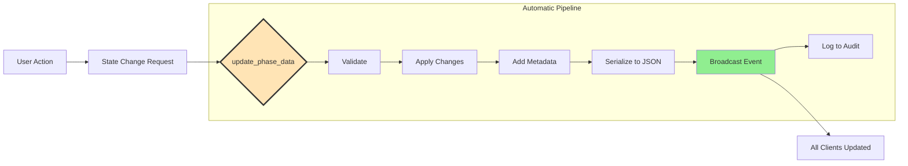
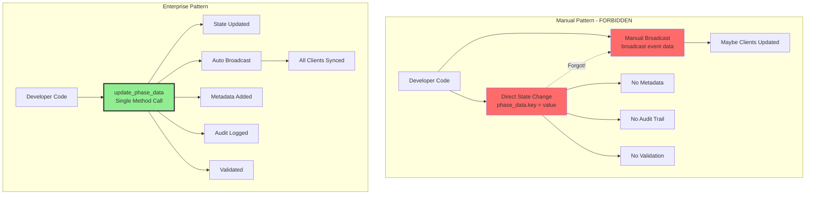
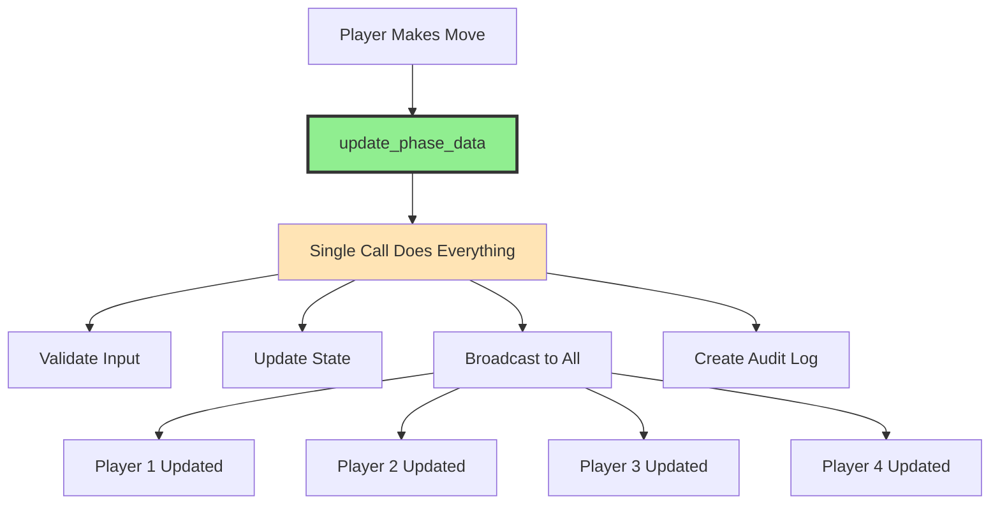
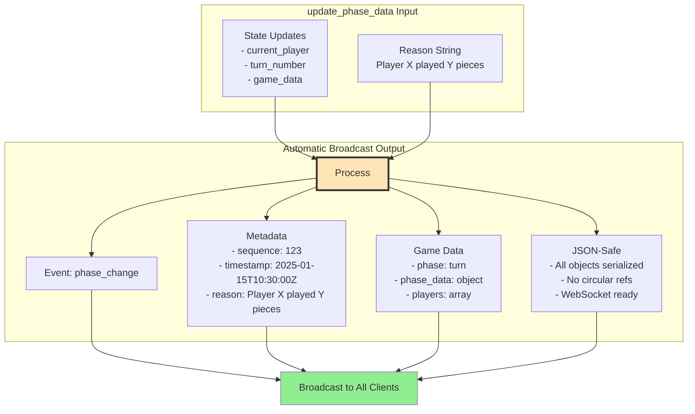
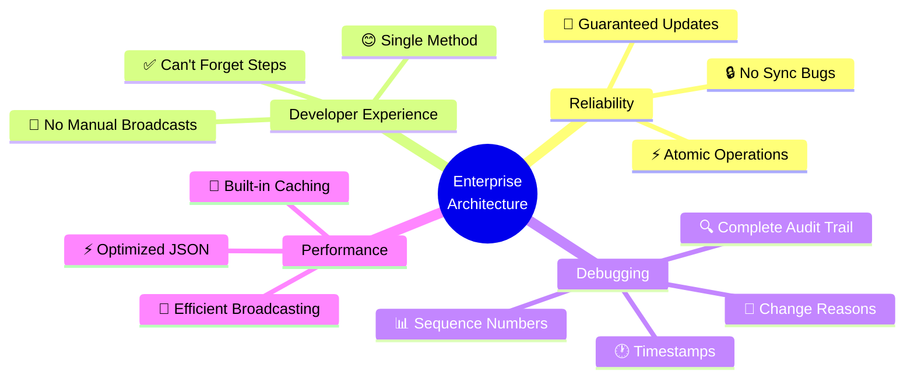

# State Machine Event Flow - Alternative Visualizations

## Option 1: Layered Architecture View (Recommended)

Shows the enterprise architecture as distinct layers.

## Option 2: Pipeline View

Shows the data transformation pipeline.

## Option 3: Before/After Comparison

Shows the difference between manual and enterprise patterns.

## Option 4: Simplified Flow

Focus on the key benefit - automatic synchronization.

## Option 5: Event Data Structure

Shows what's included in every automatic broadcast.

## Option 6: Benefits Focus

Visual representation of why enterprise architecture matters.

## Recommendation

I recommend **Option 1 (Layered Architecture View)** as the primary diagram because:
- Shows the clear separation of concerns
- Easy to trace the flow from user action to client updates
- Highlights the enterprise core that makes everything automatic
- Visual distinction between layers

You could supplement with **Option 3 (Before/After)** to dramatically show why the enterprise pattern is superior to manual approaches.
