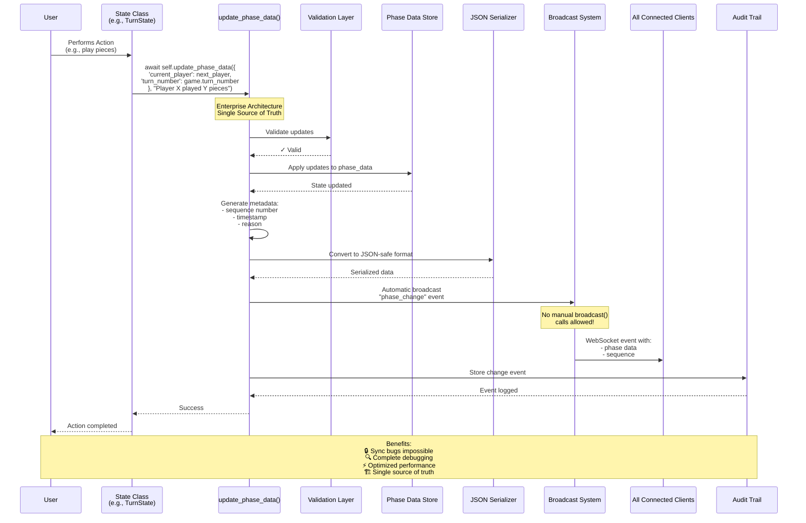

# State Machine Event Flow - Automatic Broadcasting System

This diagram illustrates how the Enterprise Architecture ensures automatic synchronization and eliminates manual broadcasting bugs.



## Key Points

1. **Single Source of Truth**: All state changes MUST go through `update_phase_data()`
2. **Automatic Broadcasting**: No manual `broadcast()` calls - everything is automatic
3. **Complete Metadata**: Every broadcast includes sequence numbers, timestamps, and reasons
4. **JSON-Safe Serialization**: All data automatically converted for WebSocket transmission
5. **Audit Trail**: Every change is tracked for debugging and analysis

## Code Example

```python
# ✅ CORRECT - Enterprise Pattern
await self.update_phase_data({
    'current_player': next_player,
    'turn_number': game.turn_number,
    'piece_count': len(pieces)
}, "Player moved - automatic broadcasting")

# ❌ WRONG - Manual Pattern (FORBIDDEN)
self.phase_data['current_player'] = next_player  # Bypasses enterprise system
await broadcast(room_id, "state_change", data)   # No automatic features
```
