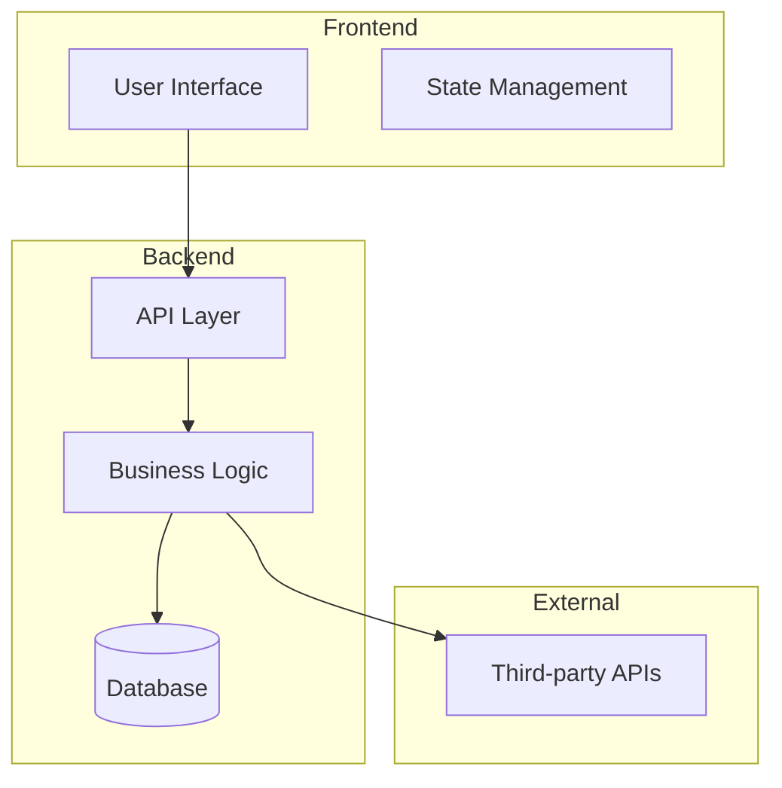

# Castellan Portfolio Page - Improvement Guide

## Overview

This guide provides a comprehensive checklist of improvements for your Castellan project page at `http://localhost:4323/projects/castellan`. While I cannot directly view your page, these recommendations are based on portfolio best practices and successful technical project presentations.

## 🎯 Essential Elements Checklist

### 1. Above-the-Fold Impact

#### Hero Section Must-Haves
- [ ] **Project Title & Tagline**: Clear, compelling one-liner explaining what Castellan does
- [ ] **Hero Visual**: Screenshot, GIF, or live demo embed showing Castellan in action
- [ ] **Key Metrics**: 3-4 impressive numbers (performance, scale, users, etc.)
- [ ] **CTA Buttons**: Prominent buttons for [Live Demo] [View Code] [Case Study]
- [ ] **Tech Stack Badges**: Visual representation of technologies used

**Example Structure:**
```
Castellan - [Your Compelling Tagline]
[Hero Image/GIF of Castellan in Action]

🚀 Live Demo | 📚 View Code | 🔍 Case Study

Key Achievements:
• [Metric 1] • [Metric 2] • [Metric 3] • [Metric 4]

Built with: [Tech badges]
```

### 2. Problem-Solution Narrative

#### Clear Problem Statement
- [ ] **The Challenge**: What problem does Castellan solve?
- [ ] **Why It Matters**: Business/technical value
- [ ] **Target Users**: Who benefits from this solution?

#### Solution Overview
- [ ] **Approach**: How you solved the problem
- [ ] **Key Innovations**: What makes your solution unique
- [ ] **Results**: Measurable outcomes/improvements

**Template:**
```markdown
## The Challenge
[2-3 sentences explaining the problem]

## My Solution
[Brief overview of your approach]

## Key Results
• [Result 1 with metric]
• [Result 2 with metric]
• [Result 3 with metric]
```

### 3. Technical Architecture

#### Visual System Design
- [ ] **Architecture Diagram**: High-level system overview (use Mermaid or similar)
- [ ] **Data Flow Diagram**: How information moves through the system
- [ ] **Tech Stack Visualization**: Layered view of technologies
- [ ] **Interactive Elements**: Clickable areas for more details

**Example Architecture Diagram:**


### 4. Feature Showcase

#### Core Features Section
- [ ] **Feature List**: 5-6 key features with icons
- [ ] **Feature Details**: Brief explanation of each
- [ ] **Visual Proof**: Screenshots or GIFs for each feature
- [ ] **Technical Implementation**: Brief "how it works"

**Feature Card Template:**
```
┌─────────────────────────────┐
│ 🎯 Feature Name             │
├─────────────────────────────┤
│ [Screenshot/GIF]            │
│                             │
│ Brief description of what   │
│ this feature does and why   │
│ it's valuable.              │
│                             │
│ Tech: [Implementation note] │
└─────────────────────────────┘
```

### 5. Code Quality & Examples

#### Code Showcase
- [ ] **Clean Code Example**: 2-3 elegant code snippets
- [ ] **Design Patterns**: Highlight sophisticated patterns used
- [ ] **Best Practices**: Show testing, error handling, etc.
- [ ] **Performance Optimizations**: Before/after comparisons

**Code Example Format:**
```python
# Highlight: [What this demonstrates]
def elegant_solution():
    """Brief explanation of why this is good."""
    # Clean, well-commented code
    # That demonstrates skill
    pass

# Why this matters: [Business value]
```

### 6. Performance & Metrics

#### Quantifiable Achievements
- [ ] **Performance Metrics**: Load time, response time, throughput
- [ ] **Scale Metrics**: Users handled, data processed, concurrent operations
- [ ] **Quality Metrics**: Test coverage, code quality scores, uptime
- [ ] **Comparison**: Before/after or vs. alternatives

**Metrics Dashboard Example:**
```
Performance Metrics
━━━━━━━━━━━━━━━━━━
Load Time:      0.8s (↓ 75%)
API Response:   45ms avg
Throughput:     10K req/s
Uptime:         99.9%
Test Coverage:  85%
Bundle Size:    380KB
```

### 7. Technical Deep Dive

#### Implementation Details
- [ ] **Architecture Decisions**: Why you chose specific technologies
- [ ] **Challenges Overcome**: Technical hurdles and solutions
- [ ] **Optimization Story**: How you improved performance
- [ ] **Security Measures**: How you protected user data

**Challenge-Solution Format:**
```
Challenge: [Specific technical problem]
Research: [What you investigated]
Solution: [Your implementation]
Result: [Measurable improvement]
Impact: [Business value delivered]
```

### 8. Visual Elements

#### Essential Visuals
- [ ] **Demo GIF/Video**: 15-30 second showcase
- [ ] **Architecture Diagram**: System overview
- [ ] **User Flow**: How users interact
- [ ] **Mobile Responsive**: Show mobile/tablet views
- [ ] **Performance Charts**: Visual metrics
- [ ] **Before/After**: Improvements made

### 9. Documentation & Code

#### Repository Presentation
- [ ] **GitHub Link**: Prominent, well-structured repo
- [ ] **README Quality**: Professional, comprehensive
- [ ] **Live Demo**: Working deployment
- [ ] **Setup Instructions**: Easy to run locally
- [ ] **API Documentation**: If applicable
- [ ] **Contributing Guide**: Shows collaboration readiness

### 10. User Experience

#### UX Considerations
- [ ] **Loading States**: Show skeleton screens or spinners
- [ ] **Error Handling**: Graceful error messages
- [ ] **Responsive Design**: Works on all devices
- [ ] **Accessibility**: WCAG compliance mentioned
- [ ] **Performance**: Fast, smooth interactions

## 🚀 Improvement Priorities

### High Priority (Implement First)
1. **Hero Visual**: Add compelling screenshot/GIF
2. **Live Demo**: Ensure it's accessible and working
3. **Problem Statement**: Clear, concise explanation
4. **Architecture Diagram**: Visual system overview
5. **Key Metrics**: Quantifiable achievements

### Medium Priority (Enhance Impact)
1. **Code Examples**: Show your best work
2. **Performance Metrics**: Real numbers
3. **Feature Showcase**: Visual feature cards
4. **Technical Challenges**: Story of problems solved
5. **Mobile Screenshots**: Responsive design proof

### Low Priority (Polish)
1. **Animations**: Subtle entrance effects
2. **Interactive Elements**: Hover states, tooltips
3. **Video Demo**: If GIF isn't sufficient
4. **Testimonials**: User feedback if available
5. **Future Roadmap**: Shows continued development

## 📝 Content Structure Template

### Optimal Page Flow
```
1. Hero Section (5 seconds to hook)
   - Title + Tagline
   - Hero visual
   - CTA buttons
   - Tech stack

2. Problem & Solution (15 seconds)
   - The challenge
   - Your approach
   - Key results

3. Technical Overview (30 seconds)
   - Architecture diagram
   - Core technologies
   - Design decisions

4. Feature Showcase (45 seconds)
   - Main features
   - Visual demos
   - Technical details

5. Deep Dive (2 minutes)
   - Code examples
   - Performance metrics
   - Challenges solved

6. Call to Action
   - Try demo
   - View code
   - Contact you
```

## 🎨 Design Recommendations

### Visual Hierarchy
- **Font Sizes**: Clear hierarchy (H1 > H2 > H3 > Body)
- **Spacing**: Generous whitespace between sections
- **Colors**: Consistent palette, good contrast
- **Images**: High quality, optimized loading
- **Icons**: Consistent style throughout

### Interactive Elements
- **Hover States**: All clickable elements
- **Smooth Scrolling**: Between sections
- **Code Highlighting**: Syntax colors
- **Image Galleries**: Lightbox for screenshots
- **Copy Code**: Button for code snippets

## 💡 Castellan-Specific Suggestions

Based on the name "Castellan" (suggesting castle/fortress):

### Thematic Elements
- **Security Focus**: If it's security-related, emphasize protection features
- **Reliability**: Fortress-like stability and dependability
- **Architecture**: Medieval/castle theming could work well
- **Guardian Role**: Position as protective solution

### Potential Taglines
- "Your Digital Fortress"
- "Guarding Your [Data/Assets/System]"
- "Enterprise-Grade Protection"
- "Built Like a Castle, Runs Like a Dream"

## ✅ Final Checklist

Before publishing, ensure:
- [ ] Page loads in <3 seconds
- [ ] All links work (demo, code, etc.)
- [ ] Images are optimized (WebP with fallbacks)
- [ ] Mobile responsive (test all breakpoints)
- [ ] SEO meta tags included
- [ ] Analytics tracking enabled
- [ ] Contact information clear
- [ ] No lorem ipsum or placeholder content
- [ ] Spell check completed
- [ ] Code examples are syntax highlighted

## 🎯 Success Metrics

Your Castellan page is successful when:
1. **Visitors understand** what Castellan does in 10 seconds
2. **Technical skills** are clearly demonstrated
3. **Live demo** is easily accessible and impressive
4. **Code quality** is evident from examples
5. **Problem solved** is clear and valuable
6. **Next steps** are obvious (contact, explore code, etc.)

## Next Steps

1. **Audit Current Page**: Compare against this checklist
2. **Prioritize Changes**: Start with high-priority items
3. **Create Visuals**: Architecture diagram, screenshots, GIFs
4. **Write Content**: Clear, concise, value-focused
5. **Test Everything**: Links, performance, responsiveness
6. **Get Feedback**: Ask others to review
7. **Iterate**: Continuous improvements

Remember: The goal is to demonstrate technical excellence while making it easy for visitors to understand the value you delivered. Focus on clarity, visual appeal, and quantifiable achievements.
