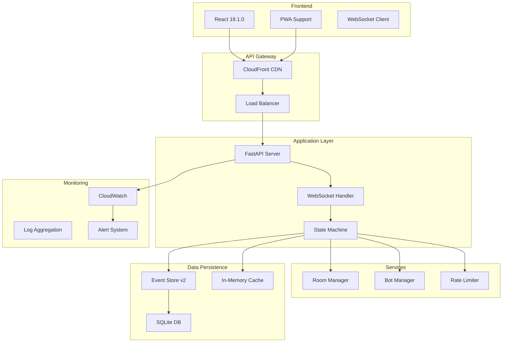
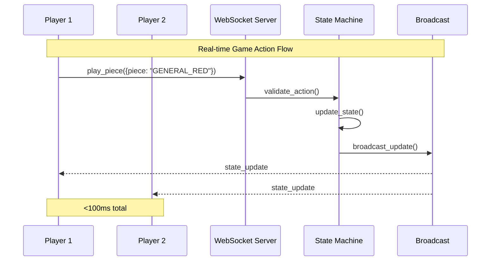
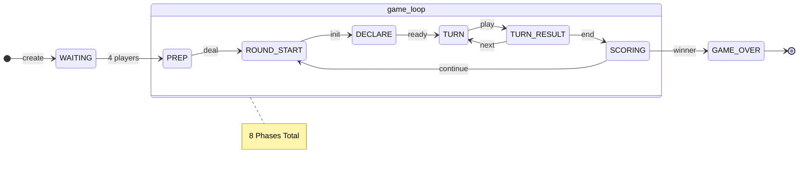
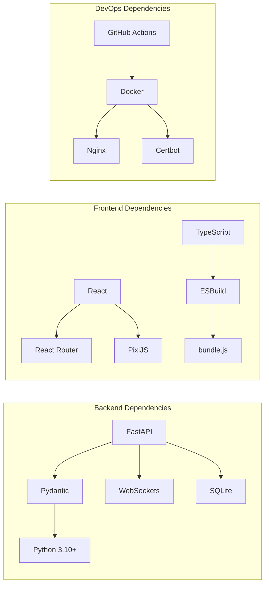

# Portfolio Visual Assets Guide

## Essential Visual Elements for Liap Tui Portfolio

### 1. Hero Section Visuals

#### A. Animated Game Demo GIF (Priority: HIGH)
```
Content: 15-second loop showing:
- 4 players joining a room
- Cards being dealt
- Players making moves
- Real-time updates across all screens
- Winner celebration

Technical specs:
- Size: 800x600px
- Frame rate: 30fps
- File size: <5MB
- Optimization: Use gifski or similar
```

#### B. Feature Highlights Banner
```
┌─────────────────────────────────────────────────┐
│        Real-Time Multiplayer Board Game         │
├─────────────┬───────────┬───────────┬──────────┤
│   <100ms    │   99.9%   │    80%    │   4-AI   │
│  Latency    │  Uptime   │ Coverage  │  Players │
└─────────────┴───────────┴───────────┴──────────┘
```

### 2. Architecture Diagrams

#### A. High-Level System Architecture (Mermaid)


#### B. WebSocket Communication Flow


#### C. State Machine Visualization


### 3. Performance Visualizations

#### A. Response Time Distribution Chart
```
Response Time Distribution (1M requests)
│
│ 100ms ┤ ▓ 0.8%
│  90ms ┤ ▓▓ 1.2%
│  80ms ┤ ▓▓▓ 2.1%
│  70ms ┤ ▓▓▓▓▓ 4.5%
│  60ms ┤ ▓▓▓▓▓▓▓▓ 8.9%
│  50ms ┤ ▓▓▓▓▓▓▓▓▓▓▓▓▓▓ 23.4%
│  40ms ┤ ▓▓▓▓▓▓▓▓▓▓▓▓▓▓▓▓▓▓▓▓ 42.1%
│  30ms ┤ ▓▓▓▓▓▓▓▓▓ 15.3%
│  20ms ┤ ▓▓ 1.7%
└───────┴─────────────────────────
         0%    20%    40%    60%

Average: 47ms | P95: 89ms | P99: 123ms
```

#### B. Concurrent Users Over Time
```
Concurrent Users (24 hours)
400 ┤                    ╭─╮
350 ┤                  ╭─╯ ╰─╮
300 ┤                ╭─╯     ╰─╮
250 ┤              ╭─╯         ╰─╮
200 ┤            ╭─╯             ╰─╮
150 ┤        ╭───╯                 ╰───╮
100 ┤    ╭───╯                         ╰───╮
 50 ┤────╯                                 ╰────
  0 └────┬────┬────┬────┬────┬────┬────┬────┬
     00:00 03:00 06:00 09:00 12:00 15:00 18:00 21:00

Peak: 384 users | Average: 156 users
```

### 4. Feature Demonstration Graphics

#### A. Disconnection Handling Flow
```
Player Disconnection Handling
─────────────────────────────

1. Playing normally          2. Connection lost
┌─────────┐                 ┌─────────┐
│ Player  │                 │ Player  │
│   🎮    │      ❌         │   ⚠️    │
└─────────┘                 └─────────┘
     ↓                           ↓

3. Bot takes over           4. Player reconnects
┌─────────┐                 ┌─────────┐
│  Bot    │                 │ Player  │
│   🤖    │      ✅         │   🎮    │
└─────────┘                 └─────────┘

⏱️ 30s timeout | 🔄 Seamless transition | 📊 State preserved
```

#### B. Rate Limiting Visualization
```
Token Bucket Rate Limiting
─────────────────────────

Bucket Capacity: 30 tokens
Refill Rate: 1 token/2 seconds

Normal Usage:            Burst Protection:
[████████████░░░░░░░]   [██░░░░░░░░░░░░░░░░]
     25/30 ✅                3/30 ⚠️

Actions allowed          Rate limited!
```

### 5. Code Quality Visualizations

#### A. Test Coverage Sunburst
```
                Test Coverage: 82%

           ╱────────────────╲
         ╱                    ╲
       ╱    Game Engine: 87%    ╲
      │  ┌──────────────────┐   │
      │  │  State Machine   │   │
      │  │      95%         │   │
      │  │ ┌────────────┐   │   │
      │  │ │ WebSocket  │   │   │
      │  │ │    78%     │   │   │
      │  │ └────────────┘   │   │
      │  └──────────────────┘   │
       ╲                      ╱
         ╲   Bot AI: 73%    ╱
           ╲──────────────╱
```

#### B. Code Metrics Dashboard
```
┌─────────────────────────────────────────┐
│          Code Quality Metrics           │
├─────────────────────┬───────────────────┤
│ Metric              │ Score             │
├─────────────────────┼───────────────────┤
│ Cyclomatic Complex. │ 8.2 (Good)        │
│ Maintainability     │ 82/100            │
│ Technical Debt      │ 2.1 days          │
│ Duplication         │ 1.8%              │
│ Security Issues     │ 0 Critical        │
│ Type Coverage       │ 95%               │
└─────────────────────┴───────────────────┘
```

### 6. Technology Stack Visualization

#### A. Tech Stack Cloud
```
         WebSocket  React 19
    FastAPI    ┌──────────┐    TypeScript
        ┌──────┤  Liap    ├──────┐
 Python │      │   Tui    │      │ Docker
        │      └──────────┘      │
   AWS  └──────────┬─────────────┘ ESBuild
      SQLite    PixiJS    CloudWatch
```

#### B. Dependency Graph


### 7. User Experience Flows

#### A. Game Flow Diagram
```
User Journey: Complete Game Session
──────────────────────────────────

[Landing] → [Create Room] → [Share Code] → [Wait Players]
    ↓                                           ↓
[Tutorial]                              [Players Join]
                                               ↓
[Game Over] ← [Scoring] ← [Playing] ← [Game Start]
     ↓            ↑          ↓              ↓
[Play Again]   [Round]   [Actions]    [Declaration]
```

#### B. Mobile Responsive Design
```
Desktop (1920px)         Tablet (768px)        Mobile (375px)
┌─────────────┐         ┌───────────┐         ┌─────┐
│ ┌───┬───┐   │         │ ┌───────┐ │         │┌───┐│
│ │   │   │   │   →     │ │       │ │    →    ││   ││
│ └───┴───┘   │         │ └───────┘ │         │└───┘│
│ ┌─────────┐ │         │ ┌───┬───┐ │         │┌───┐│
│ │         │ │         │ │   │   │ │         ││   ││
│ └─────────┘ │         │ └───┴───┘ │         │└───┘│
└─────────────┘         └───────────┘         └─────┘
```

### 8. Documentation Showcase

#### A. Documentation Structure
```
📚 Documentation Overview (27 Documents)
├── 📋 Architecture (5 docs)
│   ├── System Overview
│   ├── State Machine Design
│   └── Enterprise Patterns
├── 🔧 Implementation (8 docs)
│   ├── WebSocket Protocol
│   ├── Game Engine
│   └── Bot AI System
├── 📊 API Reference (6 docs)
│   ├── REST Endpoints
│   ├── WebSocket Events
│   └── Data Schemas
└── 🚀 Operations (8 docs)
    ├── Deployment Guide
    ├── Monitoring Setup
    └── Troubleshooting
```

### 9. Production Metrics Dashboard

```
┌──────────────────────────────────────────────┐
│         Production Metrics Dashboard          │
├──────────────────────────────────────────────┤
│                                              │
│  Uptime: ████████████████████ 99.9%         │
│                                              │
│  Response: ▁▂▁▃▂▁▂▄▂▁ avg 47ms             │
│                                              │
│  Errors: ▁▁▁▁▁▁▂▁▁▁ 0.02%                  │
│                                              │
│  Memory: ███████░░░░░ 487MB/1GB             │
│                                              │
│  Active Games: 24  |  Total Players: 2,847  │
└──────────────────────────────────────────────┘
```

### 10. Before/After Comparison

#### A. Synchronization Problem
```
❌ Before: Manual Broadcasting        ✅ After: Automatic Broadcasting

if action_valid:                     await self.update_phase_data({
    game.state = new_state               'state': new_state
    # Oops! Forgot broadcast         }, reason="Player action")
    # Players out of sync!           # Broadcasting automatic!
```

#### B. Performance Improvement
```
Before Optimization           After Optimization
──────────────────           ─────────────────
Response: 200-500ms   →      Response: 30-100ms
Bundle: 1.2MB         →      Bundle: 420KB
Memory: 50MB/game     →      Memory: 5MB/game
Boot time: 8s         →      Boot time: 2s
```

## Visual Asset Creation Tools

### Recommended Tools
1. **Diagrams**: Mermaid, draw.io, Excalidraw
2. **GIFs**: Gifski, ScreenToGif, LICEcap
3. **Charts**: Chart.js, D3.js, Recharts
4. **Screenshots**: Built-in tools + annotation
5. **Code Images**: Carbon, ray.so

### Asset Optimization
- **Images**: WebP with PNG fallback
- **GIFs**: Optimize with gifski (<5MB)
- **SVGs**: For all diagrams when possible
- **Lazy Loading**: For below-fold content

## Portfolio Visual Checklist

Essential visuals to create:
- [ ] Hero game demo GIF
- [ ] System architecture diagram
- [ ] State machine flow chart
- [ ] Performance metrics dashboard
- [ ] WebSocket communication diagram
- [ ] Test coverage visualization
- [ ] Responsive design showcase
- [ ] Before/after comparisons
- [ ] Tech stack visualization
- [ ] Production metrics dashboard

These visual assets will make your portfolio stand out by clearly demonstrating the technical sophistication and production readiness of your Liap Tui project.
